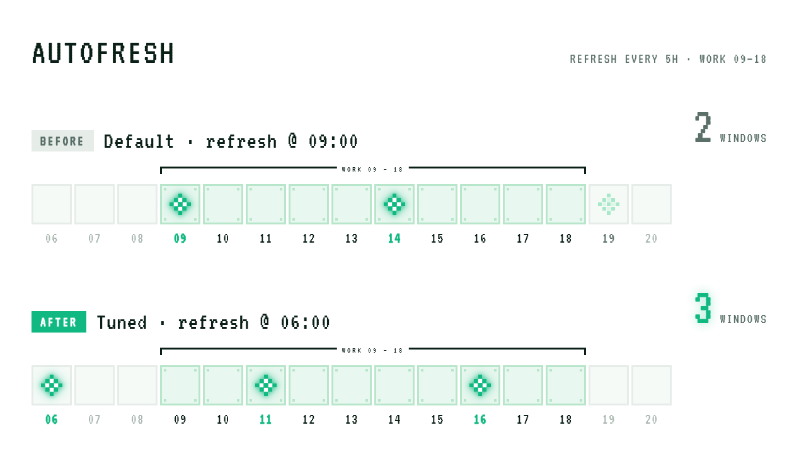

# Autofresh



A cross-platform (macOS / Linux) keep-alive tool for Codex & Claude usage.

A small CLI tool written in Go that **automatically sends keep-alive pings to Codex and Claude on a scheduled basis during working hours**, anchoring each 5-hour billing window to the time you actually need it. This ensures your limited quota is consumed during working hours rather than wasted while you're asleep or off work.

- Set a start time (e.g. 06:00), then automatically trigger at a fixed `5h10m` interval — never crossing midnight
- macOS auto-writes to `launchd`, Linux auto-writes to `crontab` — one command does it all
- Built-in `plan` / `trigger` / `logs` / `doctor` commands for viewing schedules, manual triggers, and diagnostics
- Codex uses `codex exec`, Claude uses `claude -p` — pure keep-alive pings that don't interrupt your normal usage

## Installation

**Option 1: Download prebuilt binary (recommended)**

Go to [Releases](https://github.com/loredunk/autofresh/releases) and download the executable for your platform:

| Platform | File |
|----------|------|
| macOS (Apple Silicon / M-series) | `autofresh-darwin-arm64` |
| macOS (Intel) | `autofresh-darwin-amd64` |
| Linux x86-64 | `autofresh-linux-amd64` |

```bash
chmod +x autofresh-darwin-arm64
# macOS: remove quarantine attribute
xattr -d com.apple.quarantine autofresh-darwin-arm64
```

**Option 2: Build from source**

This is a standard Go module. See [go.mod](go.mod) for dependencies; the entry point is [cmd/autofresh/main.go](cmd/autofresh/main.go).

```bash
go build -o autofresh ./cmd/autofresh
```

Requires Go 1.22 or higher.

## Commands

```bash
./autofresh set 06:00 --target all   # Set the first daily fresh time for both claude and codex
./autofresh plan        # View the current schedule
./autofresh trigger     # Send a keep-alive ping to both codex and claude
./autofresh trigger --target codex  # Send a ping to codex gpt5.4 mini only
./autofresh logs        # View all logs
./autofresh logs -n 10    # View last 10 log entries
./autofresh doctor    # Diagnose the current schedule
./autofresh delete    # Delete the schedule
```

Running `trigger` manually prints the model response to stdout so you can confirm the keep-alive actually fired. `plan` shows the current provider's model and prompt; `logs` records the model used for each trigger.

## Behavior

- Daily scheduling starts from a configured time
- Interval is fixed at `5h10m`
- Never crosses midnight
- macOS uses `launchd`
- Linux uses `crontab`
- Codex keep-alive: `codex exec --model gpt-5.4-mini --skip-git-repo-check --ephemeral "ok"`
- Claude keep-alive: `claude --model haiku -p "ok"`
